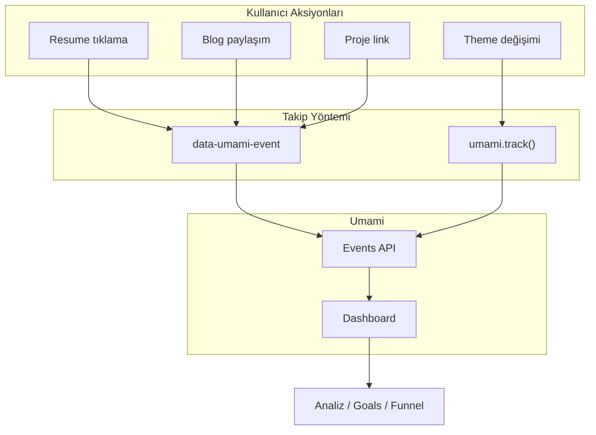

# Umami ile Buton ve Etkileşim Takibi Planı

## Mevcut Durum

- **Umami kurulumu:** [src/components/analytics/UmamiAnalytics.tsx](src/components/analytics/UmamiAnalytics.tsx) — Script `data-website-id` ile yükleniyor, varsayılan `data-auto-track` (sayfa görüntülemeleri otomatik)
- **Event takibi:** Projede `data-umami-event` veya `umami.track()` kullanımı yok
- **Umami API:** [src/lib/umami-api.ts](src/lib/umami-api.ts) — Sadece sayfa istatistikleri (pageviews, stats) çekiliyor; event verisi henüz kullanılmıyor

---

## Takip Edilebilecek Etkileşimler (Öncelik Sırasıyla)

### 1. Yüksek Değer — Dönüşüm / İletişim

> **Not:** Upvote ve Subscribe by Email şu an mock veri ile çalışıyor (API entegrasyonu yok). Yine de takip edilecek — tıklama sayısı talep/ilgi göstergesi olarak değerli.

| Etkileşim          | Konum                  | Event             | Neden                  |
| ------------------ | ---------------------- | ----------------- | ---------------------- |
| Resume indirme     | DesktopNav, MobileMenu | `resume-download` | CV indirme = iş ilgisi |
| Email tıklama      | Contact, Hero          | `contact-email`   | Doğrudan iletişim      |
| Subscribe by Email | PostSidebar            | `blog-subscribe`  | Talep/ilgi göstergesi  |
| Upvote             | PostSidebar            | `blog-upvote`     | Talep/ilgi göstergesi  |


### 2. Orta Değer — Dış Bağlantılar / Sosyal


| Etkileşim           | Konum                 | Event                                  | Neden        |
| ------------------- | --------------------- | -------------------------------------- | ------------ |
| Sosyal paylaşım     | PostSidebar           | `blog-share` + `{ platform: "twitter"  | "facebook"   |
| Sosyal link         | Hero, Footer, Contact | `social-click` + `{ platform: "github" | "linkedin"   |
| View live site      | Project detay         | `project-view-live` + `{ slug }`       | Proje ilgisi |
| View on GitHub      | Project detay         | `project-view-github` + `{ slug }`     | Proje ilgisi |
| View more on GitHub | Projects sayfası      | `projects-github`                      | Proje ilgisi |


### 3. Orta Değer — Navigasyon


| Etkileşim         | Konum                              | Event                                  | Neden                       |
| ----------------- | ---------------------------------- | -------------------------------------- | --------------------------- |
| Nav link          | DesktopNav, MobileMenu             | `nav-click` + `{ target: "/projects"   | "/blog"                     |
| Section scroll    | ActiveSectionIndicator, MobileMenu | `section-scroll` + `{ section: "about" | "projects"                  |
| Project card      | Projects, Projects sayfası         | `project-click` + `{ slug }`           | Hangi projeler ilgi çekiyor |
| View all projects | Projects                           | `nav-view-all-projects`                | Proje listesine geçiş       |


### 4. Düşük Değer — UX / Davranış


| Etkileşim          | Konum                | Event                              | Neden                           |
| ------------------ | -------------------- | ---------------------------------- | ------------------------------- |
| Theme değişimi     | ThemeToggle          | `theme-change` + `{ theme: "light" | "dark"                          |
| Analytics modal aç | HomeAnalyticsTrigger | `analytics-modal-open`             | Analytics ilgisi                |
| Code copy          | CodeBlock            | `code-copy` + `{ language }`       | Hangi kod blokları kopyalanıyor |
| View as markdown   | PostSidebar          | `blog-view-markdown`               | Teknik kullanıcı davranışı      |


---

## Uygulama Teknikleri

### 1. `data-umami-event` (HTML attribute)

**Ne zaman:** Basit `<a>` veya `<button>` tıklamaları, ekstra JS yok.

**Örnek:**

```html
<a href="/blog" data-umami-event="nav-click" data-umami-event-target="/blog">Blog</a>
```

**Örnek (data ile):**

```html
<a href={shareLinks.twitter} data-umami-event="blog-share" data-umami-event-platform="twitter">Post</a>
```

**Önemli:** `data-umami-event-`* ile tüm veriler string olarak kaydedilir. Event adı max 50 karakter.

### 2. `umami.track(event_name, data)` (JavaScript)

**Ne zaman:** `onClick` handler içinde, dinamik veri (slug, theme vb.) gerektiğinde.

**Örnek:**

```tsx
onClick={() => {
  umami.track('project-click', { slug: project.slug });
  // veya mevcut handler'dan sonra
}}
```

**TypeScript:** `window.umami` tipi için `declare global { interface Window { umami?: { track: (name: string, data?: object) => void } } }` eklenebilir.

---

## Önerilen Dosya Değişiklikleri


| Dosya                                                                               | Değişiklik                                                                 |
| ----------------------------------------------------------------------------------- | -------------------------------------------------------------------------- |
| [UmamiAnalytics.tsx](src/components/analytics/UmamiAnalytics.tsx)                   | `window.umami` tipi için global type (opsiyonel)                           |
| [DesktopNav.tsx](src/components/layout/header-parts/DesktopNav.tsx)                 | Nav linkler + Resume butonu `data-umami-event`                             |
| [MobileMenu.tsx](src/components/layout/header-parts/MobileMenu.tsx)                 | Nav linkler + Resume + section scroll `data-umami-event`                   |
| [Footer.tsx](src/components/layout/Footer.tsx)                                      | `renderSocialLinks` çağrısına event ekleme; ThemeToggle için `umami.track` |
| [SocialLinks.tsx](src/components/ui-widgets/SocialLinks.tsx)                        | `data-umami-event` + `data-umami-event-platform`                           |
| [social-links.tsx](src/lib/social-links.tsx)                                        | `renderSocialLinks` Link bileşenine `data-umami-event` prop                |
| [ThemeToggle.tsx](src/components/ui-widgets/ThemeToggle.tsx)                        | `onClick` içinde `umami.track('theme-change', { theme })`                  |
| [PostSidebar.tsx](src/components/blog/PostSidebar.tsx)                              | Upvote, Subscribe, Share, View markdown linkleri `data-umami-event`        |
| [Projects.tsx](src/components/sections/Projects.tsx)                                | Project card Link + View all link `data-umami-event`                       |
| [projects/[slug]/page.tsx](src/app/(main)/projects/[slug]/page.tsx)                 | View live, View GitHub, All projects linkleri `data-umami-event`           |
| [projects/page.tsx](src/app/(main)/projects/page.tsx)                               | Project card + View more GitHub `data-umami-event`                         |
| [contact/page.tsx](src/app/(main)/contact/page.tsx)                                 | Email link + social linkleri `data-umami-event`                            |
| [ActiveSectionIndicator/index.tsx](src/components/ActiveSectionIndicator/index.tsx) | Section scroll `umami.track`                                               |
| [CodeBlock.tsx](src/components/blog/CodeBlock.tsx)                                  | Copy `umami.track()`                                                       |
| [HomeAnalyticsTrigger.tsx](src/components/analytics/HomeAnalyticsTrigger.tsx)       | Analytics açma butonu `data-umami-event`                                   |


---

## Umami Dashboard'da Event Görüntüleme

- **Events sayfası:** Tüm event'ler `Events` sekmesinde listelenir
- **Properties:** `data-umami-event-`* veya `umami.track(name, data)` ile gönderilen veriler `Properties` sekmesinde görünür
- **Analiz:** `Goals` / `Funnel` ile event bazlı conversion analizi yapılabilir

---

## Limitler (Umami Dokümantasyonu)

- Event adı: **max 50 karakter**
- Event data: **max 50 property**, string max 500 karakter
- `data-umami-event` kullanan elementlerde: **diğer event listener'lar tetiklenmez** — bu yüzden `onClick` ile birlikte kullanılacaksa `umami.track` tercih edilmeli

---

## Özet Akış




